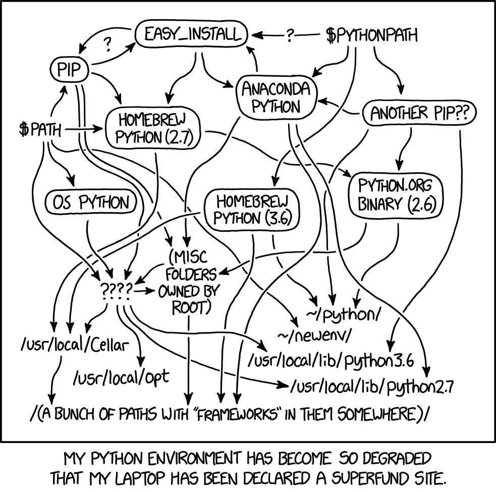

# Introduction to Docker

<!-- .slide: data-timing="10" -->

--

## Audience

- Are you a researcher?  <!-- .element: class="fragment" data-fragment-index="1" -->
- (or Research Software Engineer)  <!-- .element: class="fragment" data-fragment-index="2" -->
- Have you heard of Docker?  <!-- .element: class="fragment" data-fragment-index="3" -->
- Not sure where to start?  <!-- .element: class="fragment" data-fragment-index="4" -->
- Not sure about best practices?  <!-- .element: class="fragment" data-fragment-index="5" -->

<!-- .slide: data-timing="20" -->

--

### You've come to the right place!

<!-- .slide: data-timing="10" -->

--

## Me

- Software Engineer  <!-- .element: class="fragment" data-fragment-index="1" -->
- Build software infrastructure for researchers  <!-- .element: class="fragment" data-fragment-index="2" -->
- Help researchers to use computational tools  <!-- .element: class="fragment" data-fragment-index="3" -->
- Was a 'container skeptic'  <!-- .element: class="fragment" data-fragment-index="4" -->

<!-- .slide: data-timing="20" -->

--

## CyVerse

Helps researchers:  <!-- .element: class="fragment" data-fragment-index="1" -->

1. Learn about, and  <!-- .element: class="fragment" data-fragment-index="2" --> 
2. Productively use  <!-- .element: class="fragment" data-fragment-index="3" -->

New tech like containers  <!-- .element: class="fragment" data-fragment-index="4" -->

<!-- .slide: data-timing="20" -->

---

## Analysis is getting complex

- Multiple software packages (R, Python, etc.)  <!-- .element: class="fragment" data-fragment-index="1" -->
- With specific versions  <!-- .element: class="fragment" data-fragment-index="2" -->
- Have to work together  <!-- .element: class="fragment" data-fragment-index="3" -->
- On different platforms  <!-- .element: class="fragment" data-fragment-index="4" -->

<!-- .slide: data-timing="30" -->

--

## The pain

- Hard to install one-by-one   <!-- .element: class="fragment" data-fragment-index="1" -->
- Wasted effort and time  <!-- .element: class="fragment" data-fragment-index="2" -->
- Fragile, hard-to-reproduce analyses  <!-- .element: class="fragment" data-fragment-index="3" -->

<!-- .slide: data-timing="30" -->

--

   <!-- .element height="500" width="500" style="border: 0; background: None; box-shadow: None" -->

<!-- .slide: data-timing="30" -->

Note:
- https://xkcd.com/1987/

--

## Help! Make it stop!

How we we make it easy to install & use things consistently?  <!-- .element: class="fragment" data-fragment-index="1" -->

<!-- .slide: data-timing="10" -->

--

## <span>Containers!</span> <!-- .element: class="fragment" data-fragment-index="0" --> <sup>*</sup> <!-- .element: class="fragment" data-fragment-index="2" -->

New packages & apps are increasingly available as containers (BioContainers, etc.)  <!-- .element: class="fragment" data-fragment-index="3" -->

Note:
- "BioContainers is an open source and community-driven framework which provides system-agnostic executable environments for bioinformatics software. BioContainers framework allows software to be installed and executed under an isolated and controllable environment."
- There will be a webinar specifically on BioContainers in the near future

<!-- .slide: data-timing="30" -->

---

## Concepts & Terms

Note:
- These are broad strokes

<!-- .slide: data-timing="2" -->

--

## Image

A self-contained, read-only 'snapshot' of your applications and packages, with all their dependencies

<!-- .element: class="fragment" data-fragment-index="1" -->

<!-- .slide: data-timing="20" -->

--

## Dockerfile

Executable instructions (script) for:  <!-- .element: class="fragment" data-fragment-index="1" -->

- Creating an image  <!-- .element: class="fragment" data-fragment-index="2" -->
- Specifing the 'entry point' for the container  <!-- .element: class="fragment" data-fragment-index="3" -->

<!-- .slide: data-timing="20" -->

--

## Container

- A 'running image'
<!-- .element: class="fragment" data-fragment-index="1" -->

Note:
- The entry point is executed
- From Matt Rich's Singularity tutorial: The running container will have exactly the environment defined in the image.

<!-- .slide: data-timing="30" -->

--

## Docker

- A server (sometimes called a daemon): A program that runs in the background, and handles life cycle of images and containers  <!-- .element: class="fragment" data-fragment-index="1" -->
- A command-line client: You use it to tell the server what to do  <!-- .element: class="fragment" data-fragment-index="2" -->

<span>Download from: <https://www.docker.com/></span>  <!-- .element: class="fragment" data-fragment-index="3" -->

Note:
The reason they made a separate server and client is so that you can have the server program running on a different machine from the the client

<!-- .slide: data-timing="30" -->

--

   <!-- .element height="100%" width="100%" style="border: 0; background: None; box-shadow: None" -->

<!-- .slide: data-timing="30" -->

--

   <!-- .element height="100%" width="100%" style="border: 0; background: None; box-shadow: None" -->

<!-- .slide: data-timing="30" -->

--

## Singularity

A way to run containers on HPC/OSG  <!-- .element: class="fragment" data-fragment-index="1" -->

<span>Find out more: <https://www.sylabs.io/singularity/></span>  <!-- .element: class="fragment" data-fragment-index="2" -->

Note:
- Because of computer security reasons HPC folks usually don't allow Docker
- It is easy to create Singularity images from Docker images
- With Singularity there is no separate server and client
- Conceptually simpler than Docker

<!-- .slide: data-timing="20" -->

--

## What about my data?

Do not put your data in the image!  <!-- .element: class="fragment" data-fragment-index="1" -->

1. Local data  <!-- .element: class="fragment" data-fragment-index="2" -->
	- Volumes  <!-- .element: class="fragment" data-fragment-index="3" -->
	- Bind  <!-- .element: class="fragment" data-fragment-index="4" -->
2. Remote data: Pull into the container once it's running (e.g. CyVerse Data Store, S3, etc.)  <!-- .element: class="fragment" data-fragment-index="5" -->

Note:
- Volumes are the recommended way to expose local data to containers
- Tyson will show us how to use a volume
- "Bind mounts" make the host's filesystem accessible inside the container.

<!-- .slide: data-timing="30" -->

--

## Compute resources

I need more!  <!-- .element: class="fragment" data-fragment-index="1" -->

Talk to us. There are a few options, and it depends on what you need.  <!-- .element: class="fragment" data-fragment-index="2" -->

<!-- .slide: data-timing="20" -->

--

## Sharing containers

Image registries  <!-- .element: class="fragment" data-fragment-index="1" -->

Note:
- Docker Hub and Singularity Hub

<!-- .slide: data-timing="20" -->

---

## Using Containers

<!-- .slide: data-timing="2" -->

--

## Demo: Command line app

```bash
echo See RTD
```

Note:
- See BioContainer Example: https://github.com/CyVerse-learning-materials/container_camp_workshop_2019/tree/master/examples
- The above commands assumes that you have Docker installed

<!-- .slide: data-timing="300" -->

--

## Demo: Web app (Jupyter)

```bash
echo See RTD
```

Note:
- Explain local IP & port

<!-- .slide: data-timing="300" -->

---

## CyVerse support for containers

1. Command line (Atmosphere)  <!-- .element: class="fragment" data-fragment-index="1" -->
2. Interactive apps (VICE)  <!-- .element: class="fragment" data-fragment-index="2" -->
3. HPC (XSEDE & OSG) <!-- .element: class="fragment" data-fragment-index="3" -->

Note:
- On Atmosphere run: `ezd` or `ezs`
- First will install Docker, the second Singularity

<!-- .slide: data-timing="60" -->

---

## Summary

- Package your analysis pipeline in a single container  <!-- .element: class="fragment" data-fragment-index="1" -->
- Everyone in your lab can have a consistent environment  <!-- .element: class="fragment" data-fragment-index="2" -->

<!-- .slide: data-timing="20" -->

--

## Links & references

- [Docker](https://www.docker.com/)
- [Singularity](https://www.sylabs.io/singularity/)
- [Play with Docker Classroom](https://training.play-with-docker.com/)
- [Katacode - Learn Docker](https://www.katacoda.com/courses/docker/)
- [CyVerse Container Camp materials](https://cyverse-container-camp-workshop-2019.readthedocs-hosted.com/)
- [Reproducible research with containers](http://typingducks.com/blog/reproducible_research_with_containers/)
- [Upendra's Cybercarpentry workshop notes](https://cyverse-cybercarpentry-container-workshop-2018.readthedocs-hosted.com/en/latest/)
- [Tyson Swetnam's Container Camp Presentation](https://gitpitch.com/tyson-swetnam/cc-camp)
- [Matthew Rich's Singularity workshop](https://nuitrcs.github.io/singularity-workshop/)
- [BioContainers](https://biocontainers.pro/)

<!-- .slide: data-timing="10" -->

--

   <!-- .element height="100%" width="100%" style="border: 0; background: None; box-shadow: None" -->
